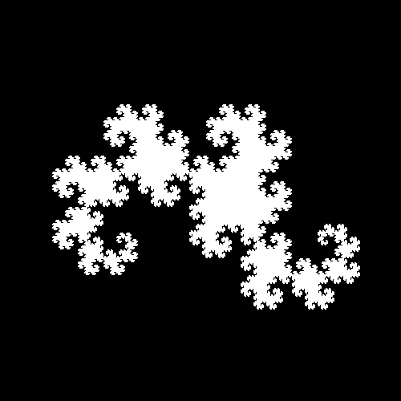
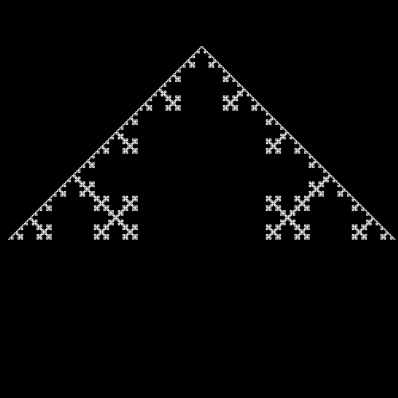
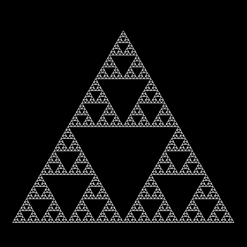

# L-Systems
[L-System](https://en.wikipedia.org/wiki/L-system) engine written in C.

## Examples
<div style="display: flex; justify-content: space-between;">
    
    
    
</div>

Configs can be found in the [examples](./examples/) folder.

## Compiling
To compile the project you will need `SDL2` and `SDL2_gfx` installed and configured in `pkg-config`.

After that run
```sh
git clone https://github.com/Denloob/l-systems.git
cd l-systems
make
```

For more information please see the [Makefile](./Makefile).

## Running

After compiling, you can find the binary at `./bin/lSystem`.

You can also use
```sh
make run
```
To both compile and run the L-system.

## Using a Custom L-System

You can change/create L-systems by changing the functions in [config.c](./src/config.c).

The `config_create` function will create all the configuration for the L-system.

This config will later be passed to `config_execute` which executes the L-system described
by the config and draws it.

After the function exits, `config_destroy` will be called to clean-up the memory used by the config.
